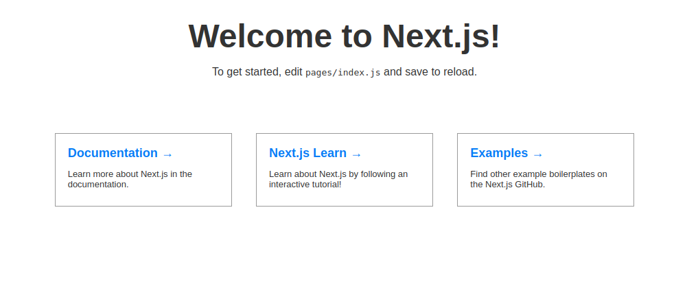
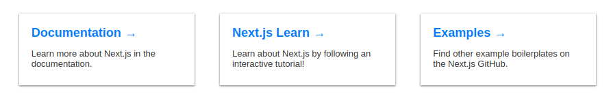

# Tutorial

Exploring how to create shadow using CSS

## Initialization

You can create basic project using `create-next-app`. What it do is create project using `Next.js` framework. `Next.js` is using React.js and some opinionated techniques like routing, PWA, SSR, etc.

So I recommend running the command:

```
yarn create next-app
```

You can also use `npm install` or `npx` but `yarn` is just easier to use.

Documentation for `yarn create` command says: `"Creates new projects from any create-* starter kits"`

So it work only with the packages that starts with `create-<package-name>` followed by the `<package-name>`. Example: `yarn create next-app` from package `create-next-app`

## Running project

Next we will check created project with `yarn dev` script. You can see other scripts in `package.json` file, under `"scripts"` field

After running this command we can follow to `http://localhost:3000` and we should see this



We want to experiment with shadows on our 3 cards

## Locate styles

In `Next.js` all accesible pages are located in `pages` folder. There we can find `index.js` file, source code for our page.

We can locate our cards

```
<a href="https://nextjs.org/docs" className="card">
    <h3>Documentation &rarr;</h3>
    <p>Learn more about Next.js in the documentation.</p>
</a>
<a href="https://nextjs.org/learn" className="card">
    <h3>Next.js Learn &rarr;</h3>
    <p>Learn about Next.js by following an interactive tutorial!</p>
</a>
<a
    href="https://github.com/zeit/next.js/tree/master/examples"
    className="card"
>
    <h3>Examples &rarr;</h3>
    <p>Find other example boilerplates on the Next.js GitHub.</p>
</a>
```

And from that locate styles for card

```
<a href="https://nextjs.org/docs" className="card">
```

Next.js using `styled-jsx` of CCS-in-JS technique.

In the same file we can locate styles

```
.card {
    padding: 18px 18px 24px;
    width: 220px;
    text-align: left;
    text-decoration: none;
    color: #434343;
    border: 1px solid #9b9b9b;
}
```

## box-shadow

CSS have `box-shadow` property, which creates shadows. Arguments in order is `horizontal offset`, `vertical offset`, `blur radius`, `spread radius`, `color`. It can have others arguments as well, you can find detailed description [here](https://www.w3schools.com/cssref/css3_pr_box-shadow.asp)

So let's try shadow with offsets and color (blur and spread are optional parameters)

```
box-shadow: 10px 10px #434343;
```

You will see shadow that appeared to right and down of the cards. Let's add blur
```
box-shadow: 10px 10px 15px #434343;
```

The more value of `blur` (third argument: 15px) the more blurred shadow we will get

Now adding spread
```
box-shadow: 10px 10px 2rem 1rem #434343;
```
The more spread the further away shadow will expand

Let's create nice shadow
```
box-shadow: 5px 5px 5px #9b9b9b;
```

We can combine shadows using comma and use the fact that shadow appearing on the other side as well when big enough blur is used
```
box-shadow: 0 1px 3px #9b9b9b, 0 1px 2px #9b9b9b;
```

After deleting border we can see the result:




